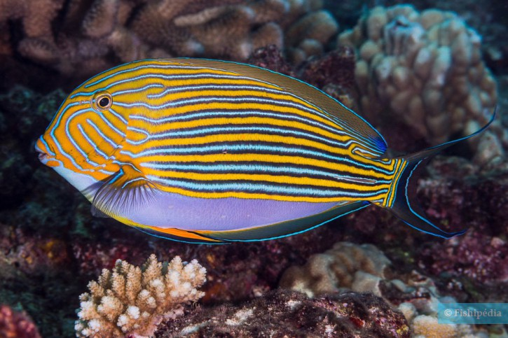

class: inverse, center, middle

# Les API


---

## Qu'est-ce qu'une API ?

`r fontawesome::fa_i("hand-point-right", class = "dark")` &nbsp;Interface de Programmation Applicative


---

## Qu'est-ce qu'une API ?

- Protocole HTTP(S) : Affichage d'une page web

--

<br />

.center[]


---

## Qu'est-ce qu'une API ?

- Protocole HTTP(S) : Affichage d'une page web

<br />

.center[]


---

## Qu'est-ce qu'une API ?

- Requête via API

<br />

.center[]

<br />

`r fontawesome::fa_i("hand-point-right", class = "dark")` &nbsp;Accès via interfaces en ligne de commande :
`r fontawesome::fa_i("r-project")`
&nbsp;/&nbsp;
`r fontawesome::fa_i("python")`
&nbsp;/&nbsp;
`r fontawesome::fa_i("js")`
&nbsp;/&nbsp;
`r fontawesome::fa_i("terminal")`

--

`r fontawesome::fa_i("hand-point-right", class = "dark")` &nbsp;Automatisation & Reproductibilité

--

`r fontawesome::fa_i("hand-point-right", class = "dark")` &nbsp;Différents formats de données (xml, (geo)json, yaml, texte, etc.)


---

## Qu'est-ce qu'une API ?

- Pas de protocole standardisé

- Termes et conditions d'utilisation propres

- Requiert souvent une clé d'authentification (**token**)

- Dans certains cas, quelques limitations (sur-sollicitations, # requêtes, # résultats, etc.)

---

## Sous `r fontawesome::fa_i("r-project")` de nombreux packages

Package           | Type de données
------------------|------------------
`{taxize}`        | Taxonomie
`{spocc}`         | Occurrences d'espèces
`{rcites}`        | Espèces protégées mondiales
`{rfishbase}`     | Informations sur les poissons
`{rredlist}`      | Accès à IUCN liste rouge
`{treebase}`      | Données phylogénétiques
`{traits}`        | Traits d'espèces
`{rnaturalearth}` | Données vectorielles spatiales
`{raster}`        | Données climatiques, altitude, etc.
`...`             | ...

--

`r fontawesome::fa_i("hand-point-right", class = "dark")` &nbsp;Pour aller plus loin :
&nbsp;&nbsp;&nbsp;&nbsp;&nbsp;
[**[ rOpenSci ]**](https://ropensci.org/packages/)
&nbsp;&nbsp;&nbsp;&nbsp;&nbsp;
[**[ Open Data ]**](https://github.com/ropensci/opendata/blob/master/README.md)


---

## Zoom sur le package `{taxize}`

- _A taxonomic toolbelt for R_

--

- Permet notamment :
  - vérifier les noms d'espèces
  - obtenir les synonymes
  - obtenir les noms communs (`r emo::ji("uk")` / `r emo::ji("fr")` / `r emo::ji("es")` / `r emo::ji("cn")`)
  - obtenir la classification taxonomique
  - ...

--

- Couvre de nombreuses bases de données taxonomiques :
  - Encyclopedia of Life (EOL)
  - Integrated Taxonomic Information Service (ITIS)
  - National Center for Biotechnology Information (NCBI)
  - IUCN Red List
  - World Register of Marine Species (WoRMS)
  - Global Names Resolver
  - ...

`r fontawesome::fa_i("hand-point-right", class = "dark")` &nbsp;L'accès à certaines bases de données nécessite un token


---

## Zoom sur le package `{taxize}`

<br />

.left[]

_Acanthurus lineatus_


---

## Zoom sur le package `{taxize}`

`r fontawesome::fa_i("question-circle", class = "dark")` &nbsp;Le nom d'espèce est-il bien orthographié ?

```{r echo=TRUE, eval=TRUE}
species_name <- "Acanthuurus lineatus"
```

--

<br />

```{r echo=TRUE, eval=FALSE}
taxize::gnr_resolve(names = species_name)
```

```
##           submitted_name          matched_name      data_source_title   score
## 1   Acanthuurus lineatus   Acanthurus lineatus                   NCBI    0.75
## 2   Acanthuurus lineatus   Acanthurus lineatus               Freebase    0.75
## 3   Acanthuurus lineatus   Acanthurus lineatus   Encyclopedia of Life    0.75
## 4   Acanthuurus lineatus   Acanthurus lineatus            iNaturalist    0.75
## ...
```

<br />

`r fontawesome::fa_i("hand-point-right", class = "dark")` &nbsp;Bonne orthographe : **_Acanthurus lineatus_**


---

## Zoom sur le package `{taxize}`

`r fontawesome::fa_i("question-circle", class = "dark")` &nbsp;Quel est le nom accepté ?

```{r echo=TRUE, eval=TRUE}
species_name <- "Acanthurus lineatus"
```

--

<br />

```{r echo=TRUE, eval=FALSE}
taxize::tnrs(query = species_name)
```

```
##           submittedname        acceptedname sourceid score         matchedname
## 1   Acanthurus lineatus Acanthurus lineatus     NCBI     1 Acanthurus lineatus
```

<br />

```{r echo=TRUE, eval=FALSE}
taxize::tnrs(query = species_name)$acceptedname
```
```
## [1] "Acanthurus lineatus"
```


---


## Zoom sur le package `{taxize}`

`r fontawesome::fa_i("question-circle", class = "dark")` &nbsp;Quelle est sa classification taxonomique ?

```{r echo=TRUE, eval=FALSE}
taxize::classification(x = species_name, db = "itis")
```

--

```
● Total: 1
● Found: 1
● Not Found: 0
$`Acanthurus lineatus`
                  name         rank     id
1             Animalia      kingdom 202423
2            Bilateria   subkingdom 914154
3        Deuterostomia infrakingdom 914156
4             Chordata       phylum 158852
5           Vertebrata    subphylum 331030
6        Gnathostomata  infraphylum 914179
7       Actinopterygii   superclass 161061
8            Teleostei        class 161105
9      Acanthopterygii   superorder 166082
10         Perciformes        order 167640
11       Acanthuroidei     suborder 172249
12        Acanthuridae       family 172250
13          Acanthurus        genus 172251
14 Acanthurus lineatus      species 172271
```


---


## Zoom sur le package `{taxize}`

`r fontawesome::fa_i("question-circle", class = "dark")` &nbsp;Quels sont ses synonymes ?

```{r echo=TRUE, eval=FALSE}
synonyms <- taxize::synonyms(species_name, db = "worms")
```
```
✔  Found:  Acanthurus lineatus
══  Results  ═════════════════

● Total: 1
● Found: 1
● Not Found: 0
```

--

<br />

```{r echo=TRUE, eval=FALSE}
synonyms <- as.data.frame(synonyms[[species_name]])
synonyms[ , c("scientificname", "status", "valid_name", "order")]
```

```
##             scientificname       status            valid_name         order
## 1      Acanthurus vittatus   unaccepted   Acanthurus lineatus   Perciformes
## 2       Chaetodon lineatus   unaccepted   Acanthurus lineatus   Perciformes
## 3        Ctenodon lineatus   unaccepted   Acanthurus lineatus   Perciformes
## 4        Harpurus lineatus   unaccepted   Acanthurus lineatus   Perciformes
## 5         Hepatus lineatus   unaccepted   Acanthurus lineatus   Perciformes
## 6     Rhombotides lineatus   unaccepted   Acanthurus lineatus   Perciformes
## 7         Teuthis lineatus   unaccepted   Acanthurus lineatus   Perciformes
```


---

## Zoom sur le package `{taxize}`

`r fontawesome::fa_i("question-circle", class = "dark")` &nbsp;Quels sont ses noms communs ?

```{r echo=TRUE, eval=FALSE}
taxize::sci2comm(species_name, db = "ncbi")
```

```
## [1] "lined surgeonfish"
```

<br />

```{r echo=TRUE, eval=FALSE}
taxize::sci2comm(species_name, db = "itis")
```

```
## [1] "lined surgeonfish"
```

<br />

```{r echo=TRUE, eval=FALSE}
taxize::sci2comm(species_name, db = "worms")
```

```
## [1] "lined surgeonfish" "ニジハギ"
```

--

<br />

`r fontawesome::fa_i("hand-point-right", class = "dark")` &nbsp;En `r emo::ji("fr")`  : le **Poisson chirurgien rayé** ou **Poisson chirurgien clown**


---

## Construction d'un client R

_Que faire si aucun package R n'a été développé mais qu'il existe une API ?_

--

`r fontawesome::fa_i("hand-point-right", class = "dark")` &nbsp;Construire soi-même un client R (c.-à-d. écrire soi-même les requêtes à envoyer à l'API)

--

<br />

Sous `r fontawesome::fa_i("r-project", class = "dark")` il existe de nombreux packages pour communiquer
avec les services Web (`{httr}`, `{curl}`, etc.)

--

<br />

`r fontawesome::fa_i("hand-point-right", class = "dark")` &nbsp;
[**Getting started with httr**](https://cran.r-project.org/web/packages/httr/vignettes/quickstart.html)

`r fontawesome::fa_i("hand-point-right", class = "dark")` &nbsp;
[**Best practices for API packages**](https://cran.r-project.org/web/packages/httr/vignettes/api-packages.html)

`r fontawesome::fa_i("hand-point-right", class = "dark")` &nbsp;
[**Managing secrets**](https://cran.r-project.org/web/packages/httr/vignettes/secrets.html)

--

<br />

Voyons deux exemples illustrant l'utilisation de `{httr}`


---

## IUCN Red list API

.center[[](https://apiv3.iucnredlist.org/api/v3/docs)]

`r fontawesome::fa_i("hand-point-right", class = "dark")` &nbsp;Conditions d'utilisation disponibles [**ici**](https://www.iucnredlist.org/terms/terms-of-use)

<br />

Cette API permet d'obtenir différentes informations sur les espèces en danger à l'échelle globale
- Listes d'espèces par catégorie IUCN
- Listes d'espèces par pays
- Les habitats, menaces pour chaque espèce
- _et bien d'autres..._

Elle requière un [**token**](https://apiv3.iucnredlist.org/api/v3/token)


---

## IUCN Red list API

Pour la démonstration, nous utiliserons le token fourni dans la documentation de l'API

<br />

.center[`r fontawesome::fa_i("universal-access", class = "darkbig")`]

<br />

`r fontawesome::fa_i("hand-point-right", class = "dark")` &nbsp;Si vous voulez utiliser cette API, **SVP** obtenez votre propre [**token**](https://apiv3.iucnredlist.org/api/v3/token)


---

## IUCN Red list API

- Stockons le token comme variable d'environnement dans le fichier `.Renviron`

```{r echo=TRUE, eval=FALSE}
usethis::edit_r_environ()                       # Ouverture du fichier `.Renviron`
```

- Et ajoutons cette ligne (en adaptant la valeur)

```{r echo=TRUE, eval=FALSE}
IUCN_KEY=9bb4facb6...
```

--

<br />

- Vérifions que le PAT est bien stocké (après un redémarrage de `r fontawesome::fa_i("r-project")`)

```{r echo=TRUE, eval=FALSE}
Sys.getenv("IUCN_KEY")
```

```
## [1] "9bb4facb6..."
```


---

## IUCN Red list API

`r fontawesome::fa_i("question-circle", class = "dark")` &nbsp;Combien d'espèces de chaque catégorie IUCN y a-t-il en France ?

--

- Ecrivons la requête

```{r echo=TRUE, eval=TRUE}
api_url    <- "https://apiv3.iucnredlist.org/api/v3/"
query      <- "country/getspecies/"
country    <- "FR"
iucn_token <- Sys.getenv("IUCN_KEY")

request <- paste0(
  api_url,
  query,
  country,
  "?token=",
  iucn_token
)
```
```
## [1] "https://apiv3.iucnredlist.org/api/v3/country/getspecies/FR?token=9bb4fac...
```


---

## IUCN Red list API

- Envoyons la requête à l'API et récupérons le résultat

```{r echo=TRUE, eval=TRUE}
response <- httr::GET(request)
```

--

- Affichons le statut de la réponse

```{r echo=TRUE, eval=TRUE}
httr::http_status(response)
```

--

- Sous quel format sont retournées les données ?

```{r echo=TRUE, eval=TRUE}
httr::http_type(response)
```


---

## IUCN Red list API

- Accédons au contenu de la réponse (données)

```{r echo=TRUE, eval=TRUE}
datas <- httr::content(response, as = "text")
```

```
{
  "count":3897,
  "country":"FR",
  "result":[
    {
      "taxonid":190498,
      "scientific_name":"Abida ateni",
      "subspecies":null,
      "subpopulation":null,
      "category":"VU"
    },
    {
      "taxonid":156905,
      "scientific_name":"Abida attenuata",
      "subspecies":null,
      "subpopulation":null,
      "category":"LC"
    }
    ...
  ]
}
```


---

## IUCN Red list API

- Convertissons (_parse_) ce format JSON en objet R (package `{jsonlite}`)

```{r echo=TRUE, eval=TRUE}
results <- jsonlite::fromJSON(datas)
```

--

<br />

- Quel est le format retourné ?

```{r echo=TRUE, eval=FALSE}
str(results)
```

```
## List of 3
##  $ count  : int 3897
##  $ country: chr "FR"
##  $ result :'data.frame':	3897 obs. of  6 variables:
##   ..$ taxonid        : int [1:3897] 190498 156905 156761 156390 156989  ...
##   ..$ scientific_name: chr [1:3897] "Abida ateni" "Abida attenuata"     ...
##   ..$ subspecies     : chr [1:3897] NA NA NA NA ...
##   ..$ rank           : chr [1:3897] NA NA NA NA ...
##   ..$ subpopulation  : chr [1:3897] NA NA NA NA ...
##   ..$ category       : chr [1:3897] "VU" "LC" "LC" "LC" ...
```


---

## IUCN Red list API

- Extrayons les données qui nous intéressent

```{r echo=TRUE, eval=TRUE}
species_fr <- results$result
head(species_fr)
```

--

- Nombre d'espèces par catégorie listées par l'IUCN

```{r echo=TRUE, eval=TRUE}
table(species_fr[ , "category"])
```

--

.right[`r fontawesome::fa_i("hand-point-right", class = "dark")` &nbsp; Package R ` {rredlist}`]


---

## OpenStreetMap Nominatim

.center[[](http://nominatim.openstreetmap.org/search/)]

--

`r fontawesome::fa_i("hand-point-right", class = "dark")` &nbsp;Conditions d'utilisation disponibles [**ici**](https://operations.osmfoundation.org/policies/nominatim/)

<br />

Cette API permet d'obtenir les coordonnées géographiques de lieux (villes, bâtiment, numéros de rue, etc.)

Elle ne requière aucun token. Cependant, le nombre de requêtes est limitée à 1/s

`r fontawesome::fa_i("hand-point-right", class = "dark")` &nbsp;`Sys.sleep()`


---

## OpenStreetMap Nominatim

- Ecrivons le requête de base

```
http://nominatim.openstreetmap.org/search/{{@}}?format=json&addressdetails=0&limit=1
```

```{r echo=TRUE, eval=TRUE}
api_url <- "http://nominatim.openstreetmap.org/search/"

params  <- list(
  format  = "json",                               # Format des données retournées
  details = 0,                                    # Recommendé par l'API
  limit   = 1                                     # Un seul résultat par requête
)
```

--

<br />

- Pour quelle entité géographique (`{{@}}`) ?

```{r echo=-3, eval=TRUE}
location <- "5 rue de l'école de médecine, Montpellier, France"
location <- gsub("\\s+", "%20", location)
location
```


---

## OpenStreetMap Nominatim

- Ecrivons le requête complète


```{r echo=TRUE, eval=TRUE}
request <- paste0(api_url, location)
```
```
## "http://nominatim.openstreetmap.org/search/5%20rue%20de%20l'école%20de%20méd..."
```

--

- Envoyons la requête à l'API (avec paramètres) et récupérons le résultat

```{r echo=TRUE, eval=TRUE}
response <- httr::GET(request, query = params)
```

--

- Affichons le statut de la réponse

```{r echo=TRUE, eval=TRUE}
httr::http_status(response)
```


---

## OpenStreetMap Nominatim

- Sous quel format sont retournées les données ?

```{r echo=TRUE, eval=TRUE}
httr::http_type(response)
```

--

- Accédons au contenu de la réponse (données)

```{r echo=TRUE, eval=TRUE}
datas <- httr::content(response, as = "text")
```

```
[
  {
    "place_id":259115419,
    "licence":"Data © OpenStreetMap contributors, ODbL 1.0. https://osm.org/copyright",
    "osm_type":"node",
    "osm_id":6405038665,
    "boundingbox":["43.6127241","43.6128241","3.8734359","3.8735359"],
    "lat":"43.6127741",
    "lon":"3.8734859",
    "display_name":"5, Rue de l'École de Médecine, Centre Historique, Montpellier, Hérault...",
    "class":"place",
    "type":"house",
    "importance":0.831
  }
]
```


---

## OpenStreetMap Nominatim

- Convertissons (parse) ce format JSON en objet R

```{r echo=TRUE, eval=TRUE}
results <- jsonlite::fromJSON(datas)
```

--

- Quel est le format retourné ?

```{r echo=TRUE, eval=TRUE}
class(results)
```

--

<br />

- Extrayons les données qui nous intéressent

```{r echo=TRUE, eval=TRUE}
results$lon <- as.numeric(results$lon)
results$lat <- as.numeric(results$lat)
(xy <- results[ , c("lon", "lat")])
```


---

## OpenStreetMap Nominatim

- Fiabilité du résultat ?

.pull-left[
```{r echo=TRUE, eval=FALSE}
## Fond de carte    -----

maps::map(
  region = "France",
  fill   = TRUE,
  col    = "#294557",
  border = "white"
)


## Ajout du point   -----

points(
  xy,
  pch = 17,
  col = "#a52a2a",
  cex = 2
)
```
]

.pull-right[
.center[
```{r "map1", echo=FALSE, eval=TRUE, dpi=300, fig.path="chunks/", fig.width=3, fig.height=3}
par(bg = "transparent")
maps::map(region = "France", fill = TRUE, col = "#294557", border = "white", lwd = 1, mar = rep(0, 4))
points(xy, pch = 17, col = "#a52a2a", cex = 2)
```
]
]


---
class: inverse, center, middle

# Web scraping


---

## Quésaco ?

- Extraction via des programmes informatiques (Robots) du contenu de pages Web en vue de son utilisation

- La question de la légalité : le cas Google (le gros foutage de gueule)

--

<br />

- Est-ce que tout peut-être scrapé ?
  - Compte utilisateur
  - Captchas
  - Bannissement d'IP

<br />

--

`r fontawesome::fa_i("hand-point-right", class = "dark")` &nbsp;[**Be polite!**](http://www.user2019.fr/static/pres/lt257430.pdf) with [`{polite}`](https://github.com/dmi3kno/polite/)

--

<br />

Sous `r fontawesome::fa_i("r-project")`, deux approches  :
  1. L'approche brutale (`readLines()` + `regular expressions`)
  1. Le package R : `{rvest}`


---

## Extraction de texte

`r fontawesome::fa_i("hand-point-right", class = "dark")` &nbsp;Source : [**Wikipédia**](https://fr.wikipedia.org/wiki/Liste_des_communes_de_France_les_plus_peuplées)

- Construisons l'URL de la page

```{r echo=TRUE, eval=TRUE}
base_url <- "https://fr.wikipedia.org/wiki/"
article  <- "Acanthurus_lineatus"

request  <- paste0(base_url, article)
```

--

<br />

- Ouverture d'une session HTML

```{r echo=TRUE, eval=TRUE}
html   <- rvest::html_session(request)
```
```{r echo=FALSE, eval=TRUE}
library(magrittr)
```


---

## Extraction de texte

- Extrayons le titre de la page

```{r echo=TRUE, eval=TRUE}
html %>%
  rvest::html_nodes(css = ".firstHeading") %>%
  rvest::html_text()
```


---

## Téléchargement d'une image

- Extrayons l'URL de la troisième image sur la même page

```{r echo=TRUE, eval=TRUE}
img_url <- html %>%
  rvest::html_nodes(xpath = '//*/img') %>%
  rvest::html_attr("src") %>%
  .[3]
```

```
## [1] "//upload.wikimedia.org/wikipedia/commons/thumb/5/59/Acanthurus_lineatus_2...
```

--

<br />

- Téléchargeons l'image

```{r echo=TRUE, eval=FALSE}
download.file(
  url      = paste0("https:", img_url),
  destfile = "acanthurus_lineatus.jpg"
)
```

```
essai de l'URL 'https://upload.wikimedia.org/wikipedia/commons/thumb/5/59/Acanthu...
Content type 'image/jpeg' length 24891 bytes (24 KB)
==================================================
downloaded 24 KB
```


---

## Extraction d'un tableau html

`r fontawesome::fa_i("hand-point-right", class = "dark")` &nbsp;Obtenir le nombre d'habitants des 10 communes les plus peuplées de France (source [**Wikipédia**](https://fr.wikipedia.org/wiki/Liste_des_communes_de_France_les_plus_peuplées))

- Construisons l'URL de la page

```{r echo=TRUE, eval=TRUE}
base_url <- "https://fr.wikipedia.org/wiki/"
article  <- "Liste_des_communes_de_France_les_plus_peuplées"

request  <- paste0(base_url, article)
```

--

<br />

- Ouverture d'une session HTML

```{r echo=TRUE, eval=TRUE}
html   <- rvest::html_session(request)
```


---

## Extraction d'un tableau html

- Extrayons tous les tableaux HTML de la page

```{r echo=TRUE, eval=TRUE}
tables <- rvest::html_table(html, fill = TRUE)
```

--

- Combien en a-t-on ?

```{r echo=TRUE, eval=TRUE}
length(tables)
```

--

- Seul le premier nous intéresse avec les colonnes `Commune` et `2017`

```{r echo=TRUE, eval=TRUE}
cities <- tables[[1]]
cities <- cities[-1, c(3, 7)]
cities <- cities[1:10, ]
rownames(cities) <- NULL
```


---

## Extraction d'un tableau html

- Affichons les données

```{r echo=TRUE, eval=TRUE}
cities
```

<br />

`r fontawesome::fa_i("hand-point-right", class = "dark")` &nbsp;Un peu de nettoyage est nécessaire


---

## Extraction d'un tableau html

- Renommons les colonnes

```{r echo=TRUE, eval=TRUE}
colnames(cities) <- c("city", "pop2017")
```

--

<br />

- Nettoyons le nombre d'habitants

```{r echo=TRUE, eval=TRUE}
cities$pop2017 <- gsub("[[:punct:]]|[[:space:]]", "", cities$pop2017)
cities$pop2017 <- as.numeric(cities$pop2017)
```
```{r echo=FALSE, eval=TRUE}
cities
```


---

## Bonus : Une bubble map


```{r echo=TRUE, eval=TRUE}
api_url   <- "http://nominatim.openstreetmap.org/search/"
params    <- list(format = "json", details = 0, limit = 1)

(locations <- paste0(cities$city, ",%20France"))
```

```{r echo=TRUE, eval=FALSE}
xy <- data.frame()

for (location in locations) {

  request  <- paste0(api_url, location)
  response <- httr::GET(request, query = params)

  datas    <- httr::content(response, as = "text")
  results  <- jsonlite::fromJSON(datas)

  tmp <- results[ , c("lon", "lat")]
  xy  <- rbind(xy, tmp)

  Sys.sleep(1)
}
```

```{r echo=FALSE, eval=TRUE}
xy <- data.frame(
  lon = c(
     2.3514992, 5.3699525, 4.8320114,  1.4442469, 7.2683912,
    -1.5541362, 3.8767337, 7.7507127, -0.5800364, 3.0635282
  ),
  lat = c(
    48.8566101, 43.2961743, 45.7578137, 43.6044622, 43.7009358,
    47.2186371, 43.6112422, 48.5846140, 44.8412250, 50.6365654
  )
)
```


---

## Bonus : Une bubble map

```{r echo=-1, eval=TRUE}
cities[1, 1] <- "Paris"
(xy <- cbind(cities, xy))
```


---
class: middle

.pull-left[
```{r echo=TRUE, eval=FALSE}
## Fond de carte        -----
maps::map(
  region = "France",
  fill   = TRUE,
  col    = "#294557",
  border = "white"
)


## Ajout des points     -----
points(
  x   = xy$lon,
  y   = xy$lat,
  pch = 19,
  col = "#a52a2a88",
  cex = sqrt(cities$pop2017)/(100*pi)
)

## Ajout des villes     -----
text(
  x      = xy$lon,
  y      = xy$lat,
  labels = xy$city,
  col    = "white",
  pos    = 3,
  cex    = 0.75
)
```
]

.pull-right[
.center[
```{r "map2", echo=FALSE, eval=TRUE, dpi=300, fig.path="chunks/", fig.width=3, fig.height=3}
par(bg = "transparent", family = "serif")
maps::map(region = "France", fill = TRUE, col = "#294557", border = "white", lwd = 1, mar = rep(0, 4))
points(xy[ , c("lon", "lat")], pch = 19, col = "#a52a2a", cex = sqrt(cities$pop2017)/(100 *pi))
text(
  x      = xy$lon,
  y      = xy$lat,
  labels = xy$city,
  col    = "white",
  pos    = sample(1:4, nrow(xy), replace = TRUE),
  cex    = 0.75
)
```
]
]


---
class: inverse, center, middle

# Pratique
